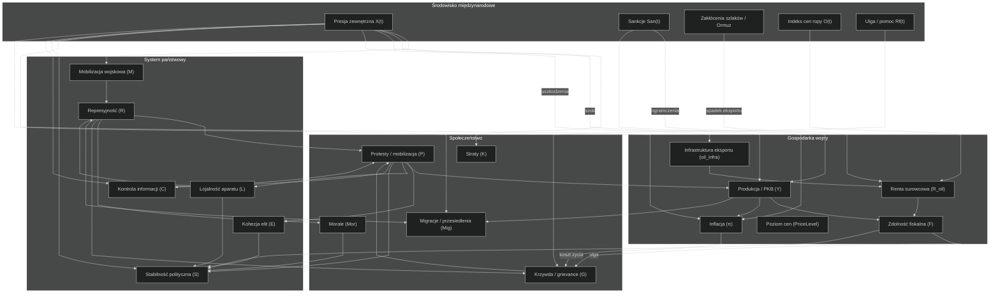
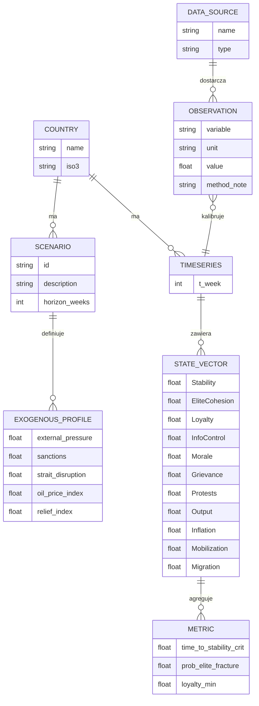
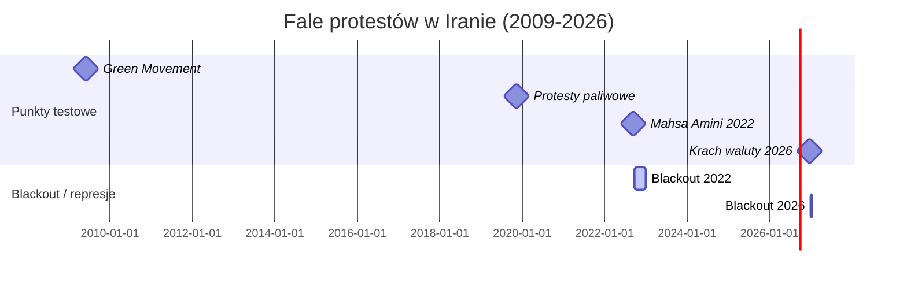

# Symulacja Kaskady Sieciowej

## Pełny model symulacyjny konfliktu (system dynamics) dla Iranu w warunkach wojny z NATO

### 1. Streszczenie wykonawcze

Celem projektu jest zbudowanie jawnego i falsyfikowalnego modelu **system dynamics (SD)**, który opisuje, jak w hipotetycznej wojnie z NATO mogą ewoluować stabilność polityczna, lojalność aparatu państwowego, mobilizacja wojskowa, gospodarka wojny, kontrola informacji oraz reakcje społeczne w Iranie.

Model nie ma charakteru operacyjnego. Jest narzędziem badawczym typu **„co-jeśli”**, służącym do porównywania scenariuszy, testowania hipotez i badania wrażliwości układu. W obecnej wersji repozytorium umożliwia porównanie trzech głównych scenariuszy: **szybka wojna**, **impas** oraz **eskalacja regionalna**. Pozwala także uruchamiać symulacje **Monte-Carlo**, wykonywać **global sensitivity analysis** metodami **Morrisa** i **Sobola** oraz estymować progi przejścia fazowego na podstawie wyników Sobola.

Projekt dostarcza kompletny kod w Pythonie, równania w kroku tygodniowym, generatory scenariuszy, pipeline do analizy czułości oraz wykresy i artefakty wynikowe. Wyniki demonstracyjne nie stanowią prognozy politycznej ani wojskowej. Są wyłącznie ilustracją zachowania modelu pod zadanymi założeniami.

---

### 2. Status projektu

Repozytorium ma charakter **badawczo-analityczny**. Zawiera:

* implementację modelu SD w Pythonie,
* symulacje deterministyczne,
* symulacje Monte-Carlo,
* analizę wrażliwości metodą Morrisa,
* analizę wariancyjną Sobola,
* estymację bifurkacji na danych wyjściowych,
* generowanie wykresów i plików wynikowych CSV / JSON / PNG.

Model został zrefaktoryzowany do postaci **pakietowej**, dzięki czemu działa jako normalny projekt Python, a nie zbiór luźnych skryptów. Jednocześnie zachowano kompatybilność wsteczną starego sposobu uruchamiania przez `main.py` i skrypty w katalogu `scripts/`.

---

## 3. Struktura repozytorium

```text
abstrakcyjnaSymulacjaKaskadySieciowej/
├─ pyproject.toml
├─ README.md
├─ requirements.txt
├─ main.py
├─ config/
│  ├─ config.yaml
│  └─ variants/
│     └─ impas_small_mc.yaml
├─ scripts/
│  ├─ run_model.py
│  ├─ run_morris.py
│  ├─ run_sobol.py
│  └─ analyze_bifurcation.py
├─ src/
│  └─ abstrakcyjna_symulacja_kaskady_sieciowej/
│     ├─ __init__.py
│     ├─ cli.py
│     ├─ config.py
│     ├─ io_utils.py
│     ├─ model.py
│     ├─ model_interface.py
│     └─ gsa_common.py
└─ outputs/
```

---

## 4. Zakres i logika modelu

Model działa na czterech warstwach analitycznych. Warstwa państwowa obejmuje stabilność polityczną, kohezję elit, lojalność aparatu, kontrolę informacji i zdolność fiskalną. Warstwa społeczna obejmuje morale, krzywdę społeczną, protesty oraz migracje i przesiedlenia. Warstwa gospodarki wojny obejmuje produkcję, inflację, rentę surowcową oraz koszty mobilizacji. Warstwa międzynarodowa obejmuje presję zewnętrzną, sankcje, zakłócenia żeglugi i indeks cen ropy.

Horyzont analizy wynosi od jednego do pięciu lat. Krok symulacji to **jeden tydzień**. Poziom agregacji pozostaje makrosystemowy: model nie zawiera celów punktowych, danych taktycznych ani geolokalizacji.

---

## 5. Najważniejsze zmienne modelu

| Nazwa                    |                  Symbol | Typ       | Znaczenie                                     |
| ------------------------ | ----------------------: | --------- | --------------------------------------------- |
| Stabilność polityczna    |                     `S` | stock     | latentna stabilność systemu                   |
| Kohezja elit             |                     `E` | stock     | spójność koalicji rządzącej                   |
| Lojalność aparatu        |                     `L` | stock     | zdolność aparatu do wykonywania rozkazów      |
| Kontrola informacji      |            `C` / `Info` | stock     | poziom cenzury, blokad i kontroli komunikacji |
| Morale społeczne         |                   `Mor` | stock     | poziom nastrojów społecznych                  |
| Protesty                 |                     `P` | stock     | mobilizacja protestu                          |
| Zdolność fiskalna        |          `F` / `Fiscal` | stock     | zdolność finansowania aparatu i subsydiów     |
| Inflacja                 |            `π` / `Infl` | aux       | presja cenowa                                 |
| Poziom cen               |                   `CPI` | stock     | skumulowany poziom cen                        |
| Mobilizacja wojskowa     |          `M` / `Troops` | stock     | indeks mobilizacji                            |
| Migracje / przesiedlenia |     `Mig` / `Displaced` | stock     | skala przesiedleń                             |
| Presja zewnętrzna        |             `X` / `War` | exogenous | intensywność konfliktu                        |
| Sankcje                  |     `San` / `Sanctions` | exogenous | intensywność sankcji                          |
| Dochody surowcowe        | `R_oil` / `OilRevIndex` | aux       | indeks dochodów z ropy i gazu                 |

---

## 6. Scenariusze

Model wspiera trzy główne scenariusze wejściowe:

| Scenariusz           | Nazwa w CLI            |
| -------------------- | ---------------------- |
| Szybka wojna         | `szybka_wojna`         |
| Impas                | `impas`                |
| Eskalacja regionalna | `eskalacja_regionalna` |

W praktyce scenariusz wybiera profil egzogeniczny presji zewnętrznej, sankcji, zakłóceń eksportu i kosztów systemowych.

---

## 7. Diagram przepływów i mapa systemowa

Poniższy diagram przedstawia makro-zależności w modelu. Nie jest to mapa celów ani model operacyjny, lecz formalna reprezentacja sprzężeń między warstwą międzynarodową, gospodarką wojny, systemem państwowym i społeczeństwem.



---

## 8. Diagram ER pipeline danych



---

## 9. Oś czasu fal protestów



---

## 10. Równania dyskretne

Zmienne są znormalizowane do przedziału `[0,1]`, z wyjątkiem indeksów cenowych i miar pochodnych. Krok symulacji wynosi `Δt = 1 tydzień`. Po każdym kroku stosowana jest funkcja ograniczająca `clip(x, 0, 1)`.

### Zmienne egzogeniczne

`X_t`, `San_t`, `H_t`, `O_t`, `Rf_t`

### Równania pomocnicze

```math
\begin{aligned}
oilExport_t   &= oilExportBase\,
                 \bigl(1-\alpha_{\text{san}}\,San_t\bigr)
                 \bigl(1-\alpha_h\,H_t\bigr)\\
R_{\text{oil},t} &= \mathrm{clip}\!\bigl(oilExport_t\cdot oilInfra_t\bigr)\,O_t\\
F_t           &= \mathrm{clip}\!\bigl(w_Y\,Y_t + w_{\text{oil}}\,R_{\text{oil},t}\bigr)\\
reliefEff_t   &= \mathrm{clip}\!\bigl(0.5\,F_t + 0.5\,Rf_t\bigr)
\end{aligned}
```

### Przykładowe równanie produkcji

```math
\begin{aligned}
Y_{t+1}= \mathrm{clip}\!\Bigl(
  Y_t + \Delta t\bigl[
      r\,(1-Y_t)
    - d_X\,X_t
    - d_{\text{san}}\,San_t
    - d_P\,P_t
    - d_M\,M_t
    + a\,(1-San_t)(1-X_t)
    + \eta\,reliefEff_t
  \bigr]
\Bigr)
\end{aligned}
```

W kodzie repozytorium równania są zaimplementowane w postaci bardziej zwartej, w szczególności przez funkcje `step()`, `simulate()` i `compute_metrics()` w module `model.py`.

---

## 11. Metryki wyjściowe

Podstawowe metryki systemowe liczone przez model to:

| Metryka               | Opis                                                           |
| --------------------- | -------------------------------------------------------------- |
| `Tcrit`               | liczba tygodni do spadku stabilności poniżej progu krytycznego |
| `elite_fracture_prob` | wskaźnik pęknięcia elit w horyzoncie symulacji                 |
| `avg_loyal`           | średnia lojalność aparatu                                      |
| `peak_protest`        | maksymalna intensywność protestów                              |
| `end_displaced_m`     | końcowa liczba przesiedlonych                                  |

W wersjach rozszerzonych analizy można również liczyć metryki ciągłe, takie jak `min_elite`, `mean_elite`, `mean_stab`, `weeks_below_elite_crit` czy `time_to_elite_fracture`, co jest szczególnie przydatne przy analizie Sobola dla zmiennych progowych.

---

## 12. Monte-Carlo

Celem Monte-Carlo jest policzenie rozkładów metryk systemowych przy niepewności parametrów społecznych, fiskalnych i politycznych.

Typowy plan badawczy obejmuje od `500` do `10 000` iteracji. W praktyce laptopowej `500–2 000` przebiegów wystarcza do pierwszego rozpoznania. Parametry są losowane wokół wartości bazowych, a wyniki agregowane do plików CSV, JSON i PNG.

Po uruchomieniu Monte-Carlo w katalogu `outputs/` pojawiają się:

```text
mc_hist_<scenariusz>.png
mc_metrics_<scenariusz>.csv
mc_summary_<scenariusz>.json
plot_<scenariusz>.png
metrics_<scenariusz>.json
run_<scenariusz>.csv
```

---

## 13. Global Sensitivity Analysis

Repozytorium zawiera dwie metody analizy wrażliwości.

### Morris screening

Morris służy do szybkiego wykrywania parametrów o największym wpływie screeningowym. Wyniki zapisywane są do katalogu:

```text
outputs/morris/
```

Typowe artefakty:

```text
morris_indices.json
morris_model_outputs.csv
morris_mu_star_<metryka>.png
```

### Sobol indices

Sobol służy do pełnej globalnej analizy wariancji. Wyniki trafiają do katalogu:

```text
outputs/sobol/
```

Typowe artefakty:

```text
sobol_model_outputs.csv
sobol_summary.json
sobol_<metryka>_main.csv
sobol_<metryka>_bars.png
sobol_<metryka>_s2.png
```

Jeżeli metryka ma zerową lub bliską zeru wariancję wyjścia, analiza Sobola jest pomijana. To nie jest błąd modelu, lecz informacja metodologiczna, że dany wskaźnik jest zbyt progowy albo za mało czuły względem bieżących zakresów parametrów.

---

## 14. Estymacja bifurkacji

Na danych z `outputs/sobol/sobol_model_outputs.csv` można oszacować punkt przejścia fazowego między stanem stabilnym a stanem pękania elit.

W obecnej wersji estymacja korzysta z regresji logistycznej na cechach agregowanych, takich jak:

* `peak_protest_mean`
* `mean_stab_mean`
* `mean_elite_mean`
* `avg_loyal_mean`

Celem nie jest dokładne przewidywanie polityczne, lecz uchwycenie przybliżonego progu, przy którym układ przestaje zachowywać się liniowo.

---

## 15. Mapa sterowania systemem: synteza Morris + Sobol

Połączenie wyników Morrisa i Sobola pozwala zbudować hierarchię parametrów sterujących trajektoriami systemu.

Najważniejsze bloki wpływu są trzy. Pierwszy to **kontrola informacji**, reprezentowana przede wszystkim przez parametry `k_info` i `k_info_emerg`. Drugi to **dynamika protestów**, reprezentowana przez `k_mob`, `k_demob` i `k_loss_p`. Trzeci to **aparat bezpieczeństwa i koalicja władzy**, reprezentowane przez `k_loss_l`, `k_split` oraz `k_elite_cost`.

Model nie zachowuje się jak prosty układ typu:

```text
gospodarka → stabilność
```

lecz raczej jak układ:

```text
informacja → protest → aparat bezpieczeństwa → stabilność
```

Najsilniejszy mechanizm destabilizacji przyjmuje postać:

```text
spadek kontroli informacji
+ wzrost mobilizacji protestów
+ utrata lojalności aparatu
→ kaskada załamania systemu
```

W tym sensie gospodarka działa głównie pośrednio, przez stres społeczny, protest i presję na aparat państwa.

---

## 16. Architektura uruchamiania i konfiguracji

Po refaktoryzacji projekt ma jedną ścieżkę sterowania:

```text
main.py
→ cli.py
→ load_runtime_config()
→ run_simulate / run_morris / run_sobol / run_bifurcation
→ model.py / model_interface.py
```

### Zasady

* `main.py` pełni rolę launchera kompatybilności wstecznej,
* `cli.py` jest jedynym właściwym interfejsem uruchamiania,
* `config.py` jest centralnym miejscem budowy runtime config,
* `scripts/*.py` są cienkimi wrapperami bez własnej logiki eksperymentalnej.

To oznacza, że cały projekt korzysta z jednej semantyki konfiguracji i jednego sposobu składania parametrów.

---

## 17. Konfiguracja

System obsługuje dwa formaty konfiguracji.

### Format hierarchiczny

Plik bazowy `config/config.yaml` może wyglądać tak:

```yaml
scenario: impas
years: 3

mc:
  enabled: true
  n: 500
  spread: 0.20

random:
  seed_base: 12345
  rep_seed_stride: 100000

thresholds:
  stab_crit: 0.30
  elite_crit: 0.35
  elite_streak_weeks: 4

gsa:
  n_reps: 5
  morris:
    num_levels: 8
    trajectories: 30
    optimal_trajectories: 10
    local_optimization: true
  sobol:
    N: 1024
    calc_second_order: false
    num_resamples: 1000
    conf_level: 0.95

runtime:
  n_jobs: -1

paths:
  outputs_dir: outputs
```

### Format płaski

Warianty eksperymentalne mogą być zapisane jako spłaszczony runtime config:

```yaml
scenario: impas
years: 2
seed_base: 12345
n_reps: 5
rep_seed_stride: 100000
stab_crit: 0.30
elite_crit: 0.35
elite_streak_weeks: 4
mc_enabled: true
mc_n: 200
mc_spread: 0.15
morris_num_levels: 8
morris_trajectories: 20
morris_optimal_trajectories: 8
morris_local_optimization: true
sobol_N: 512
sobol_calc_second_order: false
sobol_num_resamples: 500
sobol_conf_level: 0.95
n_jobs: -1
outputs_dir: outputs/impas_small_mc
```

### Kolejność nakładania konfiguracji

Runtime config powstaje w kolejności:

```text
default config
→ plik YAML
→ override z CLI
→ coercion typów
→ walidacja
```

Dzięki temu:

* stare configi nadal działają,
* nowe configi są prostsze do eksperymentów,
* CLI ma zawsze pierwszeństwo nad YAML.

---

## 18. Instalacja

### Wariant 1 — instalacja pakietowa

Z katalogu głównego projektu:

```bash
pip install -e .
```

### Wariant 2 — wymagania klasyczne

```bash
pip install -r requirements.txt
```

---

## 19. Uruchamianie

### Najprostszy start

```bash
python main.py
```

Brak jawnej subkomendy jest automatycznie mapowany na:

```bash
python main.py simulate
```

### Symulacja deterministyczna / Monte-Carlo

```bash
python main.py simulate
```

```bash
python main.py --scenario impas --years 3
```

```bash
python main.py simulate --scenario szybka_wojna --years 2 --mc 1000 --spread 0.20
```

```bash
python main.py simulate --no-mc
```

### Morris

```bash
python main.py morris
```

```bash
python main.py morris --n-reps 7 --morris-trajectories 40 --morris-num-levels 10
```

### Sobol

```bash
python main.py sobol
```

```bash
python main.py sobol --sobol-N 2048 --sobol-num-resamples 2000
```

```bash
python main.py sobol --sobol-calc-second-order
```

### Bifurkacja

```bash
python main.py bifurcation
```

```bash
python main.py bifurcation --data outputs/sobol/sobol_model_outputs.csv
```

---

## 20. Przełączanie configów

### Bazowy config

```bash
python main.py --config config/config.yaml
```

### Wariant eksperymentalny

```bash
python main.py --config config/variants/impas_small_mc.yaml
```

### Bazowy config + override z CLI

```bash
python main.py sobol --config config/config.yaml --n-reps 10 --sobol-N 2048
```

To podejście pozwala trzymać konfiguracje eksperymentów w plikach, ale nadal modyfikować pojedyncze parametry bez przepisywania YAML.

---

## 21. Kompatybilność wsteczna

Zachowano wsparcie dla starych entrypointów:

```text
scripts/run_model.py
scripts/run_morris.py
scripts/run_sobol.py
scripts/analyze_bifurcation.py
```

Są to jednak wyłącznie cienkie wrappery. Właściwa logika nie powinna być już rozwijana w katalogu `scripts/`.

Dodatkowo zachowano zgodność API pakietu przez alias:

```python
DEFAULT_CONFIG = DEFAULT_RUNTIME_CONFIG
```

Dzięki temu starszy kod importujący `DEFAULT_CONFIG` nadal działa.

---

## 22. Uruchamianie w PyCharm

W PyCharm nie należy uruchamiać bezpośrednio pliku `__init__.py`, ponieważ nie jest on entrypointem aplikacji.

Prawidłowe punkty startowe to:

```text
main.py
scripts/run_model.py
scripts/run_morris.py
scripts/run_sobol.py
scripts/analyze_bifurcation.py
```

Working directory powinien być ustawiony na katalog główny projektu.

Jeżeli projekt nie jest zainstalowany jako pakiet editable, `main.py` sam dodaje katalog `src/` do `sys.path`, tak aby zachować poprawny import układu `src-layout`.

---

## 23. Ograniczenia metodologiczne

Model ma charakter eksploracyjny. Parametry nie są jeszcze w pełni skalibrowane empirycznie. Szczególnie zmienne takie jak kohezja elit, lojalność aparatu czy morale społeczne są modelowane częściowo przez proxy i dopasowanie historyczne.

Metryki progowe, zwłaszcza `elite_fracture_prob`, mogą mieć w analizie Sobola zbyt małą wariancję. W takich przypadkach zalecane jest używanie metryk ciągłych, takich jak minimum kohezji elit, średnia stabilność czy liczba tygodni poniżej progu krytycznego.

Wyniki modelu nie są prognozą rzeczywistości. Są formalnym testem zachowania założeń w zadanej strukturze sprzężeń.

---

## 24. Ograniczenia etyczne i prawne

Model jest przygotowany wyłącznie do analiz badawczych i dydaktycznych. Nie zawiera instrukcji działań zbrojnych, doboru celów, planowania przemocy ani optymalizacji ataku. Zmienna „presja zewnętrzna” jest abstrakcyjnym indeksem scenariuszowym, a nie opisem operacji.

Projekt ma służyć analizie odporności systemowej, dynamiki kryzysu i właściwości modeli złożonych, a nie wspieraniu działań szkodliwych.

---

## 25. Priorytetowe źródła do kalibracji i walidacji

Projekt jest kompatybilny z kalibracją na otwartych źródłach danych. Najważniejsze grupy źródeł obejmują dane o protestach i zdarzeniach politycznych, dane o kontroli informacji i blackoutach, dane makroekonomiczne, źródła energetyczne, dane o wydatkach wojskowych oraz dane o migracjach i uchodźcach.

W praktyce do dalszej kalibracji można wykorzystywać między innymi:

* ACLED,
* Freedom House,
* NetBlocks,
* World Bank,
* IMF,
* SIPRI,
* UNHCR,
* publiczne raporty ONZ i organizacji praw człowieka,
* bazy sankcyjne typu OFAC / UE / GSDB.

Część serii pozostaje nadal nieokreślona lub wymaga ręcznego przygotowania do postaci tygodniowej.

---

## 26. Dalszy rozwój

Kolejne logiczne etapy rozwoju projektu to:

* dodanie testów `pytest`,
* moduł detekcji przejścia fazowego,
* rozszerzenie metryk ciągłych dla Sobola,
* dashboard eksploracyjny,
* warstwa 27D jako interfejs interpretacyjny nad zdarzeniami modelu.

---

## 27. Licencja i przeznaczenie

Repozytorium ma charakter badawczy. Jeżeli będzie rozwijane publicznie, warto jawnie dodać licencję, opis przeznaczenia oraz sekcję o bezpiecznym użyciu modelu.
